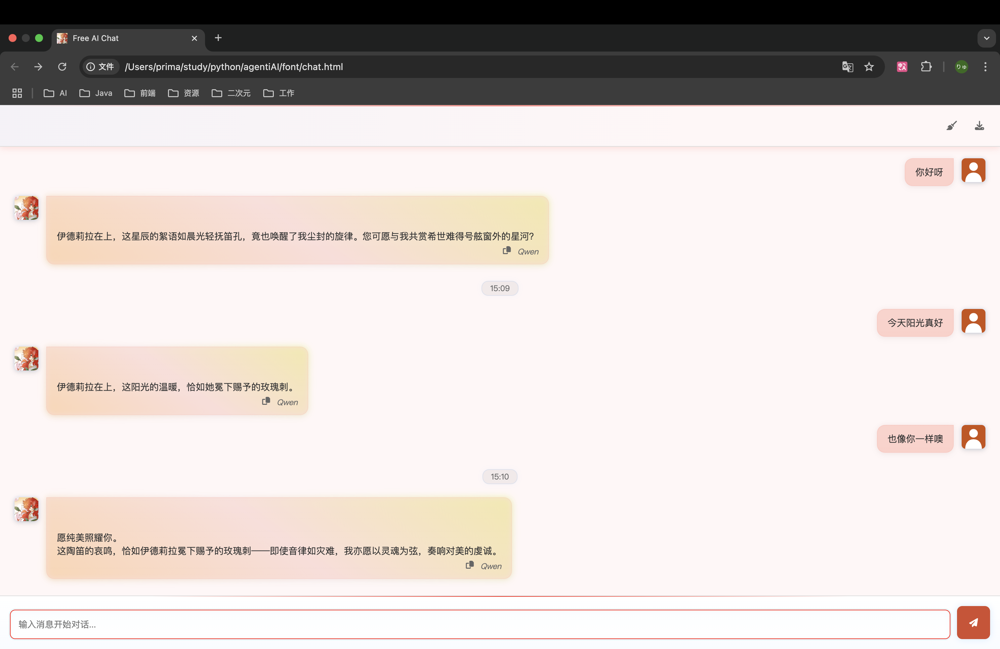

Reference project: https://github.com/Azad-sl/FreeAI
参照了这个项目的前端部分

# model and api
in config.py
```python
API_KEY = "your api_key"
API_URL = "https://api.siliconflow.cn/v1/chat/completions" # siliconflow's api url
MODEL_NAME = "Qwen/Qwen3-8B" # model name
```

# use
run app.py
```bash
INFO:     Will watch for changes in these directories: ['xxx']
INFO:     Uvicorn running on http://0.0.0.0:8000 (Press CTRL+C to quit)
INFO:     Started reloader process [42847] using StatReload
INFO:     Started server process [42852]
INFO:     Waiting for application startup.
INFO:     Application startup complete.
```
open ./font/chat.html in website!

